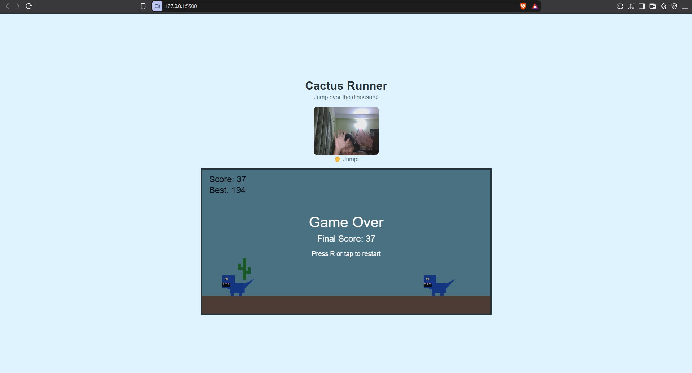

# DinoUno

## Description

DinoUno is a browser-based endless runner game inspired by the offline Google Dinosaur game, but with the roles reversed.

This time, the dinosaur gets some rest while the cactus has to run, jump, and avoid incoming dinosaurs.

The game supports keyboard, touch, and webcam gesture controls. Players can open their palm to jump and close their fist to prepare the next gesture.

## Screenshot



## How to Run

1. Download or clone the repository.
2. Open the project folder in VS Code.
3. Run `index.html` using Live Server.
4. Allow camera access for gesture controls.
5. Start playing.

## Controls

* **Open Palm:** Jump using the webcam
* **Closed Fist:** Prepare the next gesture jump
* **Spacebar:** Jump
* **Click or tap:** Jump
* **R key:** Restart after losing

## Features

* Play as a cactus
* Jump over approaching dinosaurs
* Webcam hand gesture controls
* Keyboard and touch controls
* Random dinosaur speeds
* Random obstacle spawn timing
* Smooth movement using delta time
* Collision detection
* Score tracking
* Saved high score
* Increasing difficulty
* Game Over and restart system

## Tech Stack

* HTML
* CSS
* JavaScript
* HTML Canvas API
* MediaPipe Gesture Recognizer
* Browser Local Storage

## How Gesture Control Works

DinoUno uses MediaPipe and the device camera to recognize hand gestures.

Opening your palm makes the cactus jump. After jumping, close your fist to prepare the gesture control for another jump. This prevents one open palm from repeatedly triggering jumps.

## Why I Made This Project

I made DinoUno because I wanted to experiment with controlling a game using real-time hand gestures through a webcam. I also wanted to put my own twist on the classic Chrome Dinosaur game by reversing the roles, making the cactus the player and dinosaurs the obstacles.

## AI Usage

I used AI as a development assistant while building DinoUno. It helped me with parts of the JavaScript implementation, debugging, understanding different approaches, and working through areas such as game physics, collision detection, timing, and webcam gesture controls.

I reviewed, integrated, modified, and tested the code while building the project. The game concept, feature choices, and final decisions were made by me.

## Project Structure

```text
DinoUno/
├── index.html
├── style.css
├── game.js
├── s.png
└── readme.md
```
